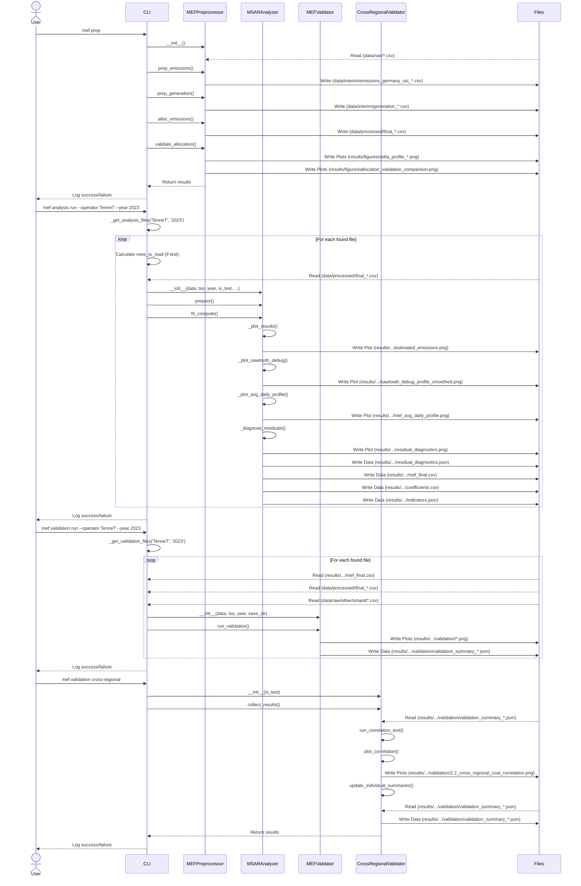

# marginal-emissions-germany
This project contains a Python pipeline to compute marginal emission factors for the German electricity market for the years 2023 and 2024. It processes high-resolution historical open source market data from official sources to model market dynamics. The results can be used to evaluate the emissions mitigation potential of demand side interventions and sector coupling technologies.

To capture the non-linear and regime-dependent behavior of the electricity market, this project uses a **Markov-Switching Autoregressive (MSAR) model**. This approach goes beyond simple linear regression by allowing the relationship between electricity generation and emissions to change depending on the underlying state of the market (e.g., "base load" vs. "peak load" regimes). By modeling these distinct regimes, the pipeline can more accurately determine which power plant type is likely to respond to a marginal change in demand, providing a more nuanced and realistic marginal emission factor.

## Project Structure
- `src/marginal_emissions/`: Main package.
    - `cli/`: CLI implementation using Click.
        - `__init_cli__.py`: Entry point for the `mef` command.
        - `preprocess_cli.py`, `analyze_cli.py`, etc.: Individual command implementations.
    - `clients/`: API clients for data fetching (ENTSO-E, SMARD) – not integrated!
    - `core/`: Core logic for preprocessing (`preprocess.py`), MSAR modeling (`analyze_msar.py`), and validation (`validate.py`).
    - `utils/`: Helper functions.
    - `vars.py`: Configuration, environment variables, and data mappings.
- `data/`:
    - `raw/`: Original CSV files from external sources.
    - `interim/`: Intermediate processing steps (UTC-converted and merged data).
    - `processed/`: Final datasets ready for MSAR analysis.
- `results/`: Output directory for analysis results.
    - `msar/`: Final coefficients, plots, and indicators for each TSO and year.
    - `figures/`: Interim plots from workflow actions.
    - `test/`: Results from test runs (e.g., sliding window iterations).
- `notebooks/`: Jupyter notebooks for exploration and testing purposes.
---

## Docker-Based Workflow

This guide describes the complete workflow from cloning the repository to running the analysis in a containerized environment. With this method, the results can be replicated on any platform.

### Prerequisites
- **Git**: Required to clone the repository.
- **Docker**: Ensure Docker is installed and running on your system.
  - For Windows and macOS, install **Docker Desktop**.
  - For Linux, install **Docker Engine**.

### Step 1: Get the Project Files

1.  **Clone the repository**: Open a terminal and run the following command to download the project files.
    ```bash
    git clone https://github.com/AK960/marginal-emissions-germany.git
    ```

2.  **Navigate into the project directory**:
    ```bash
    cd marginal-emissions-germany
    ```

3.  **Prepare Data**: Place the raw data files into the `data/raw/` directory. The project expects specific subdirectories, file structures, and naming conventions as defined in `src/marginal_emissions/vars.py`. By default, the input data for the years 2023 and 2024 is already provided within the `data/raw/`, `data/interim/`, and `data/processed/` directories.

### Step 2: Build the Docker Image (One-Time Setup)

This step builds the container image with all necessary dependencies. It only needs to be run once per machine, or on change if the `Dockerfile` or `requirements.yaml` are changed.

4.  **From the project's root directory, run the build command**:
    ```bash
    docker build -t mef-germany .
    ```
    *(This may take several minutes on the first run.)*

### Step 3: Run the Interactive Shell & Analysis

The following steps will mount the project files into the container, synch them with the local filesystem, and start an interactive shell within the container.

5.  **In your terminal, from the project's root directory, run following command**:
   - Either start the container this way with the `--rm` tag, which stops and removes the container after closing the session.
     ```bash
     docker run --rm -it -v ./data:/app/data -v ./results:/app/results mef-germany bash
     ```
   - By using the `-d` tag the container is started in the background and keeps running after exiting.
     ```bash
     # Start the container and mount the directories
     docker run -d -it --name mef-germany -v ./data:/app/data -v ./results:/app/results mef-germany bash
     # Access the container
     docker exec -it mef-germany bash
     ```
     - Since the container is now running in the background, it can be manually started and stopped. For this, the container name is necessary.
     ```bash
     # Check running and existing containers (-a)
     docker ps
     docker ps -a
     # Start and stop
     docker start mef-germany
     docker stop mef-germany
     ```
     - The container can now be manually removed using its name.
     ```bash
     docker rm -f mef-germany
     ```
*This will start the interactive shell within the container and change the command prompt e.g. to `/app #`.*

6.  **Execute `mef`-tool commands** as needed. For example:
    ```bash
    # Run the full preprocessing pipeline
    mef prep

    # Run the analysis for a specific TSO and year
    mef analysis run --operator 50Hertz --year 2023
    ```

7.  **Accessing Results**: The `-v` flag in the `docker run` command creates a live link between the container's directories and the corresponding directories on the local machine. **Any files (plots, CSVs) generated in the container will instantly appear in the `results` folder in the local filesystem.**

8.  **Run exit to leave the container**:
    ```bash
    exit
    ```

---

## Alternative: Local Conda Workflow

The project can also be run using conda. This, however, requires the manual installation of the required packages. Since this project and the corresponding `requirements.yaml` was developed on a Debian System, the setup on a Windows machine may require the manual installation of some packages. 

### Prerequisites
- **Miniconda or Anaconda**: Must be installed on your system.

### Step 1: Get the Project Files

1. **Clone the repository** and navigate into the project directory as described in the Docker workflow.

### Step 2: Create and Activate the Conda Environment

2. **Create the environment**: From the project's root directory, run the following command. It will create a new Conda environment named `mef-germany` using the `environment_clean.yaml` file. Since this file contains only the base packages, you may need to install further packages on the go.
    ```bash
    conda env create -f environment_clean.yaml
    ```
    When working on a Debian Linux system, the `requirements.yaml` already contains a complete list of the required packages. 
    ```bash
    conda env create -f environment.yaml
    ```

3.  **Activate the environment**: You must activate the environment each time you open a new terminal to work on the project.
    ```bash
    conda activate mef-germany
    ```
    Your terminal prompt should now show `(mef-germany)`.

### Step 3: Install the Project

This step installes the `mef` command-line tool within the activated environment.

4.  **Run the installation**:
    ```bash
    pip install -e .
    ```

### Step 4: Run the Analysis

With the `mef-germany` environment active, the `mef`-tool can be used directly.

5.  **Execute commands** as needed:
    ```bash
    # Check if the tool is installed correctly
    mef --version

    # Run the preprocessing
    mef prep

    # Run an analysis
    mef analysis run --operator Amprion --year 2023
    
    # Run the validation
    mef validation run --operator Amprion --year 2023
    
    # After running analysis and validation for all datasets run cross-regional validation
    mef validation cross-regional
    ```

6.  **Accessing Results**: Since the project is running locally, all results will be saved directly into the `results` directory within the local filesystem.

### Deactivating the Environment
When finished, the environment can be deactivated:
```bash
conda deactivate
```

---
## Usage

### 1. Data Fetching

NOTE: The `mef fetch` command is not fully integrated. It allows for automated data fetching from the API, yet the obtained data is not used in the later analysis process. The data for the analysis is obtained from SMARD. The platform also provides an API so that this logic could be implemented to allow for enhanced automation of the entire analysis.

The `fetch entsoe` command allows you to download data from the ENTSO-E API.
```bash
mef fetch entsoe [OPTIONS]
```

**Options:**
* `--req-type`, `-rt`: The specific endpoint to query (`actual_generation_per_generation_unit` or `aggu`, `actual_generation_per_production_type` or `agpt`).
* `--is-test`, `-t`: If set, fetches data for a single day.
* `--area`, `-a`: The control area to fetch data for (`50hertz`, `amprion`, `tennet`, `transnetbw`).
* `--start-date`, `-sd`: The start date for the data fetch (format: `yyyy-mm-dd`).
* `--end-date`, `-ed`: The end date for the data fetch (format: `yyyy-mm-dd`).

### 2. Data Preprocessing

The `prep` command runs the entire preprocessing pipeline. It loads the raw data from `data/raw`, prepares the emissions and generation datasets, and saves the final processed files to `data/processed`.

```bash
mef prep [OPTIONS]
```

**Options:**
* `--skip-validation`: If set, the validation step after emission allocation is skipped.

### 3. Data Analysis

The `analysis run` command executes the MSAR (Markov-switching autoregression) analysis on the preprocessed data. You can filter the data by transmission system operator (TSO) and year. The results, including data files and plots, are saved to a structured directory in `results/`.

```bash
mef analysis run [OPTIONS]
```

**Options:**
* `-tso`, `--operator`: Select the TSO to analyze (`50Hertz`, `Amprion`, `TenneT`, `TransnetBW`). Defaults to `All`, processing all TSOs.
* `-y`, `--year`: Select the year to analyze (`2023`, `2024`). Defaults to `All`, processing all years.
* `-t`, `--is-test`: Flag to indicate a test run. This will save results to a separate `results/test/` directory.
* `--num-iterations`: Number of sliding window iterations for the test run. Only used if `--is-test` is set. Defaults to 50.

### 4. Validation

The `validation` commands are used to validate the results of the analysis.

#### `validation run`
Runs the main validation on the results for a specific TSO and year.

```bash
mef validation run [OPTIONS]
```

**Options:**
* `--operator`, `-tso`: The TSO to validate.
* `--year`, `-y`: The year to validate.
* `--is-test`, `-t`: Whether to use test results.
* `--num-iterations`: The number of iterations for the test run.

#### `validation cross-regional`
Runs a cross-regional validation test.

```bash
mef validation cross-regional [OPTIONS]
```

**Options:**
* `--is-test`, `-t`: Whether to use test results.

### 5. Other Commands

*   **`inspect dirs`**: Lists all subdirectories in a given path.
*   **`synchtex`**: Synchronizes the analysis output with LaTeX files.
*   **`listapis`**: Lists available APIs to fetch data from.

## Workflow Sequence Diagram

The following diagram illustrates the complete workflow, from data preprocessing to analysis and validation, including file interactions.



---
## Download Links
- [Git](https://git-scm.com/install/)
- [Miniconda](https://www.anaconda.com/docs/getting-started/miniconda/main)
- [Docker](https://docs.docker.com/get-started/get-docker/)
- [Python](https://www.python.org/downloads/)