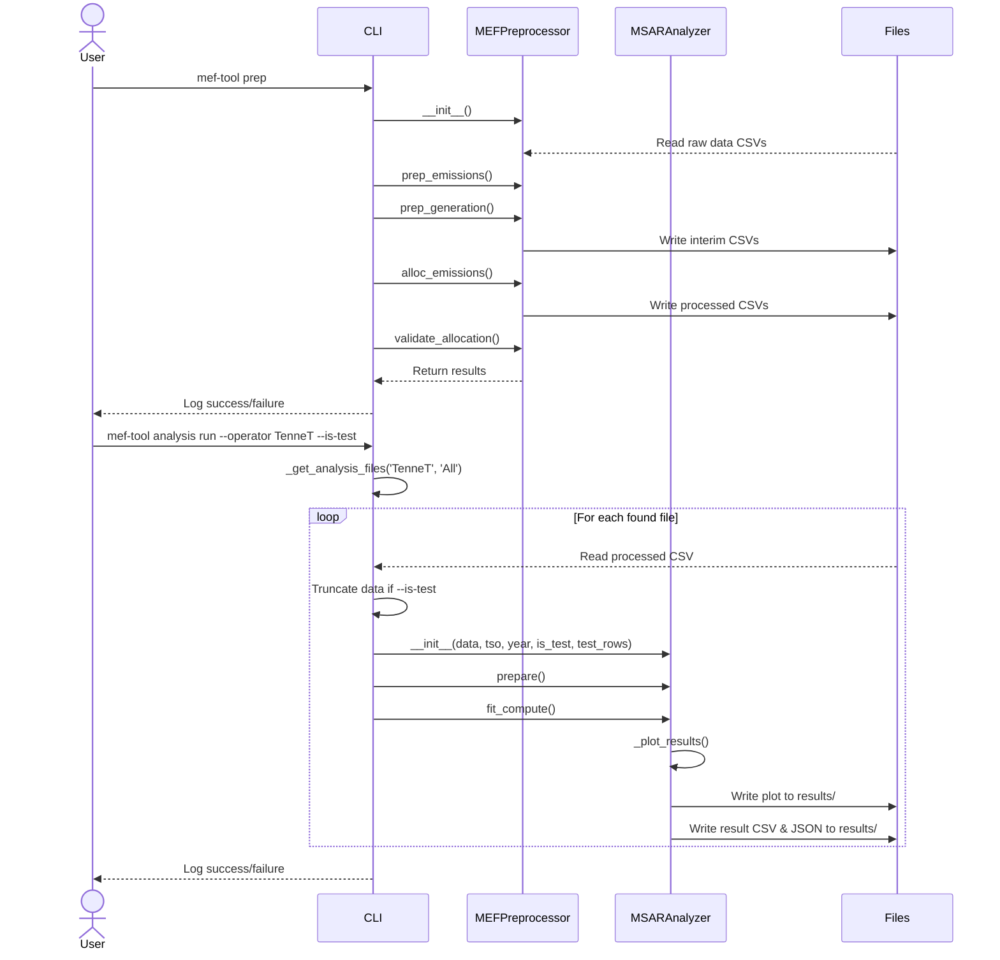

# marginal-emissions-germany
This project contains a Python pipeline to compute marginal emission factors for the German electricity market. It processes high-resolution historical open source market data from official sources to model market dynamics beyond the merit-order principle and assess the environmental impact of heatpumps, based on their marginal emissions.

---
## Usage

### 1. Data Preprocessing

The `prep` command runs the entire preprocessing pipeline. It loads the raw data from `data/raw`, prepares the emissions and generation datasets, and saves the final processed files to `data/processed`.

```bash
mef-tool prep [OPTIONS]
```

**Options:**
* `--skip-validation`: If set, the validation step after emission allocation is skipped.

### 2. Data Analysis

The `analysis run` command executes the MSAR (Markov-switching autoregression) analysis on the preprocessed data. You can filter the data by transmission system operator (TSO) and year. The results, including data files and plots, are saved to a structured directory in `results/`.

```bash
mef-tool analysis run [OPTIONS]
```

**Options:**
* `-tso`, `--operator`: Select the TSO to analyze (`50Hertz`, `Amprion`, `TenneT`, `TransnetBW`). Defaults to `All`.
* `-y`, `--year`: Select the year to analyze (`2023`, `2024`). Defaults to `All`.
* `-t`, `--is-test`: Flag to indicate a test run. This will save results to a separate `results/test/` directory.
* `--test-rows`: Number of rows to use for the test run (e.g., 100 or 1000). Defaults to 1000.

**Example (Normal Run):**
```bash
# Run analysis for TenneT for 2023
mef-tool analysis run --operator TenneT --year 2023
```

**Example (Test Run):**
```bash
# Run a test on the first 100 rows of the Amprion 2024 dataset
mef-tool analysis run --operator Amprion --year 2024 --is-test --test-rows 100
```

### 3. Workflow Sequence Diagram

The following diagram illustrates the complete workflow, from data preprocessing to analysis, including file interactions.



---
## Appendix
### [Important links]
#### ENTSOe
- [ENTSO-E API Documentation](https://documenter.getpostman.com/view/7009892/2s93JtP3F6#intro)
- [API Parameter Guide](https://transparencyplatform.zendesk.com/hc/en-us/articles/15692855254548-Sitemap-for-Restful-API-Integration)
- [EIC Manual & Codes](https://www.entsoe.eu/data/energy-identification-codes-eic/)
- [Transparency Platform Guide](https://transparencyplatform.zendesk.com/hc/en-us/categories/13771885458964-Guides) <!-- Data consumers: MoP Ref2 and Ref19 recommended -->
- [Transparency Platform Knowledge Base](https://transparencyplatform.zendesk.com/hc/en-us/categories/12818231533716-Knowledge-base)
- [Manual of Procedures](https://www.entsoe.eu/data/transparency-platform/mop/)
- [Manual of Procedures v3.5 Download with Material](https://eepublicdownloads.blob.core.windows.net/public-cdn-container/clean-documents/mc-documents/transparency-platform/MOP/MoP_v3r5_final.zip)
  - File Detailed Data Description: MoP Ref2 DDD v3r5
  - File Manual of Procedures: MoP v3r5
- [Data Description Actual Generation per Generation Unit](https://transparencyplatform.zendesk.com/hc/en-us/articles/16648326220564-Actual-Generation-per-Generation-Unit-16-1-A)
- [Data Description Actual Generation per Production Type](https://transparencyplatform.zendesk.com/hc/en-us/articles/16648290299284-Actual-Generation-per-Production-Type-16-1-B-C)

### SMARD
- [SMARD API Documentation](https://smard.api.bund.dev/)

### Agora

### MSDR
- [MarkovRegression Model Documentation](https://www.statsmodels.org/stable/generated/statsmodels.tsa.regime_switching.markov_regression.MarkovRegression.html)
- [Heteroskedasticity Explanation](https://www.google.com/search?q=heteroskedasticity&oq=heteroskedasticity&gs_lcrp=EgRlZGdlKgkIABBFGDkYgAQyCQgAEEUYORiABDIHCAEQABiABDIHCAIQABiABDIGCAMQABgeMgYIBBAAGB4yBggFEAAYHjIGCAYQABgeMgYIBxAAGB7SAQczMzFqMGoxqAIAsAIA&sourceid=chrome&ie=UTF-8#fpstate=ive&vld=cid:63ab98e5,vid:ZIOnCoi1ZRw,st:0)
- 